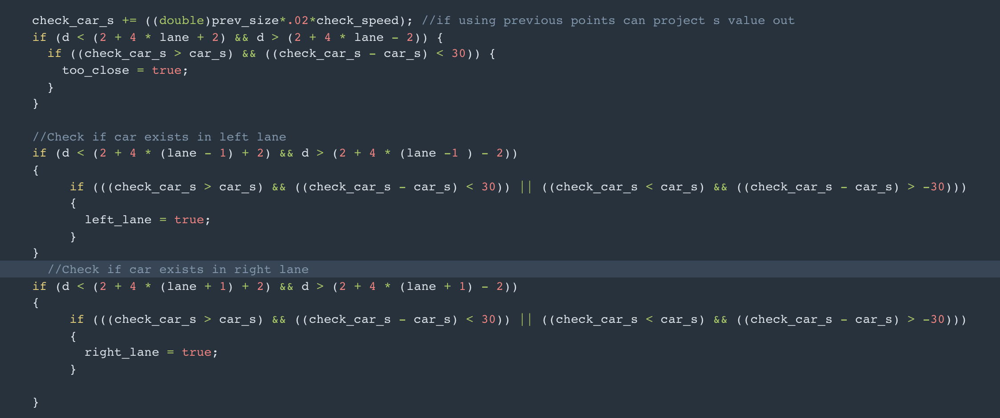
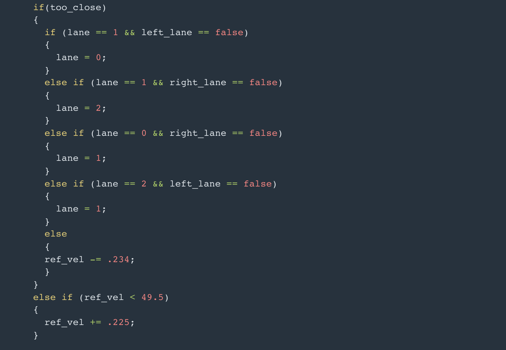
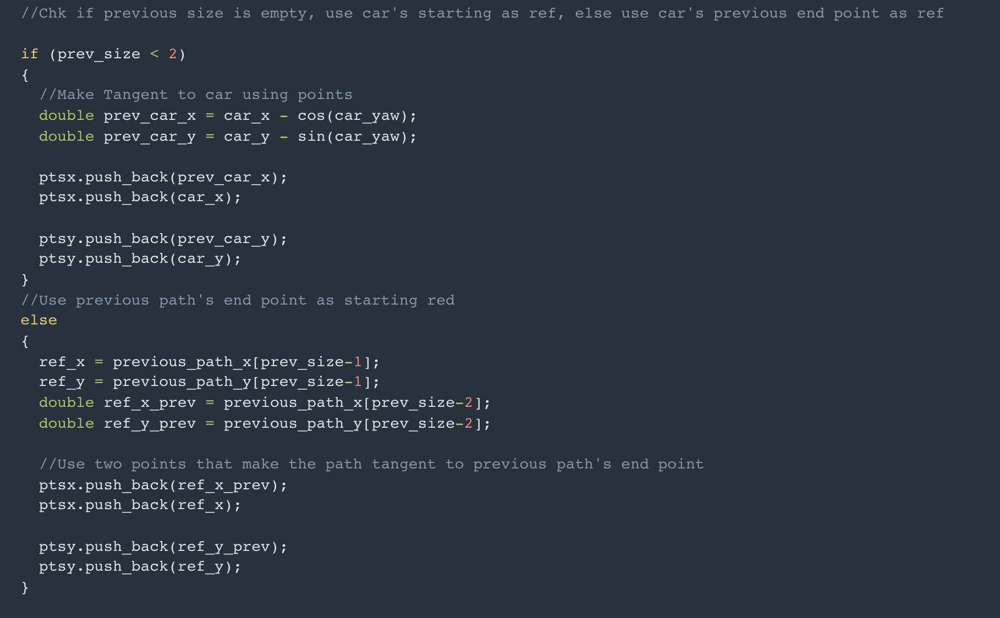
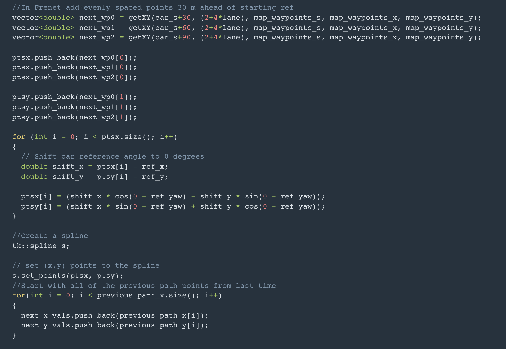
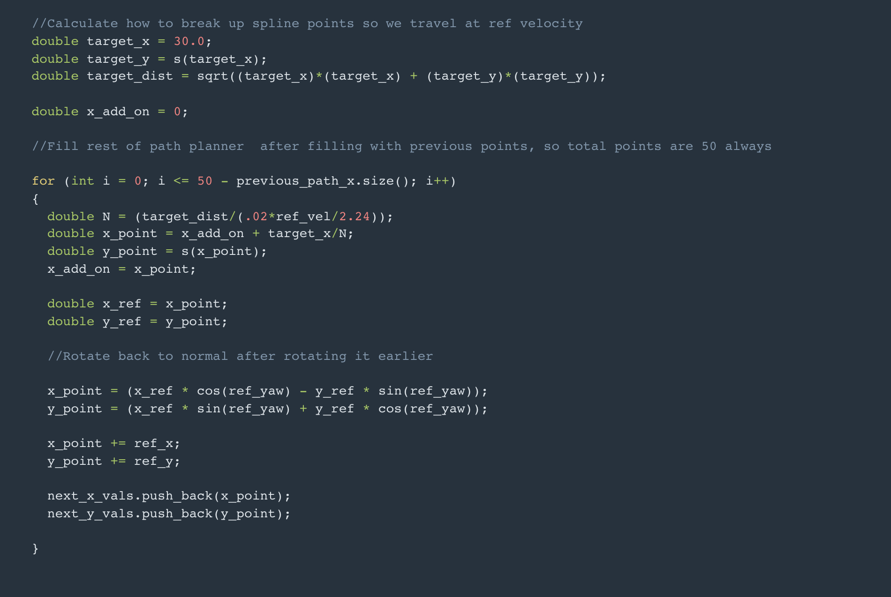

# CarND-Path-Planning-Project
The purpose of this project is to get the vehicle to drive at target speed around the highway loop and perform appropriate actions such as slowing down or lane change depending on the other cars 
   
## Modeling
The Modeling consists of multiple parts. This project was quite interesting because of the multiple things that had to happen for the car to successfully navigate. The project has 3 distinct parts as discussed in the lessons:
1. Route Planning and Prediction
2. Behavior Planning
3. Trajectory Generation

### Route Planning and Prediction

Route Planning is generally the path the vehicle decides to take from point A to point B. Since in the scope of this project, we are just going around a highway track, this does not need to be handled by the code.

Prediction is the process where we try to estimate what actions or trajectore the objects around our vehicle might be performing. This is usually obtained from sensor fusion since the different radars and lidars detect the other agents surrounding our car. In the Prediction lecture we have discussed multiple approaches for prediction such as model, data driven and hybrid. But in the scope of our current project, we simplify it to ensure our car does not crash into any other vehicle in the highway track.

As observed, we have 3 lanes in the highwaye track. Each lane iis assigned a number and each lane is assumed to be 4 meters wide. We then set 3 boolean variables, too_closse, left_lane, right_lane to be false.

We then determine which lane our car is currently present in. To establish this, we check the range of the 'd' value. If the value is between 0 to 4 then the car is in the leftmost lane i.e.,lane 0. Similarly if the 'd' value is between 4 to 8, then the car is in the center lane (lane = 1 ) and if the d value is between 8 to 12, then the car is in the rightmost lane (lane = 2).

After this is determined, we compare the future s values which are generated from behavior planning and trajectory generation of our car with the sensor fusion data to determine if an object is present 30 m ahead of us or 30 m ahead and 30 m behind on our left lane or on our right lane. This is shown below:

[IMG]IMG.png[./IMG]

### Behavior Planning

This part of the code determines the behavior taken by our car to avoid other objects in it's path. In the case of our project, if we have a vehicle in front of us in our current lane, we slow down, we then determine if the lane or right lane is empty and then perform a lane change if it is feasible. If we slow down too much that we do not detect a car in the lane ahead of usanymore we then speed up to achieve our target speed.

Tp perform this actions, we use the existing defined variables to determine when to perform a lane change. In the code, if we are in the center lane, we prefer going to the left lane if that is feasible, this is simply due to the structure of the code. There is no certain cost function defined, but in a way due to the structure of the code, this can be used to give pririty to a particular behavior over the other. For eample, if the car is in the center lane and a vehicle is present right in front of our car. Even if both right and left lanes are free, the vehicle prefers a left side lane change due to code structure.

[IMG]IMG2.png[./IMG]

If there is a car ahead in the lane and lane change is not possible, we simply reduce the velocity.

### Vehicle Trajectory Generation

This part is described in detail in the Q & A section. We determine if any previous points exists by determining the size of the previous path. 

We check if the previous points are empty, then we use the car's current location to determin the previous point by calculating the car's tangent. We then add these points to the array ptsx and ptsy.The reference x,y and yaw values are then determined from these current points.

If the previous points are available, then the previous 2 points are saved in ptsx and ptsy. Also the 1 st previous points and yaw values are saved as reference values.

Additionally 3 evenly spaced points are created in Frenet. These are then converted to XY local car coordinates using the getXY function and appended to the list (ptsx and ptsy).

We utilize the spline instead of creating a polynomial is generate a trajectory since the spline ensures a much smoother trajectory. We use the ptsx and ptsy points in the spline function. 

The previous points are added to the next_x_values and next_y_values which is the trajectory generated so that the transition to the newer trajectory points is smoother. Then considering the referrence velocity, we make a judgement as to how to break up the spline points, in our case, we split them evenly until 30 m ahead in the x direction. The number of points that we calculate is 50. We then append these values to the next_x_vals and the next_y_vals. We append the points so that the size of next_x_vals and next_y_vals is always 50.

